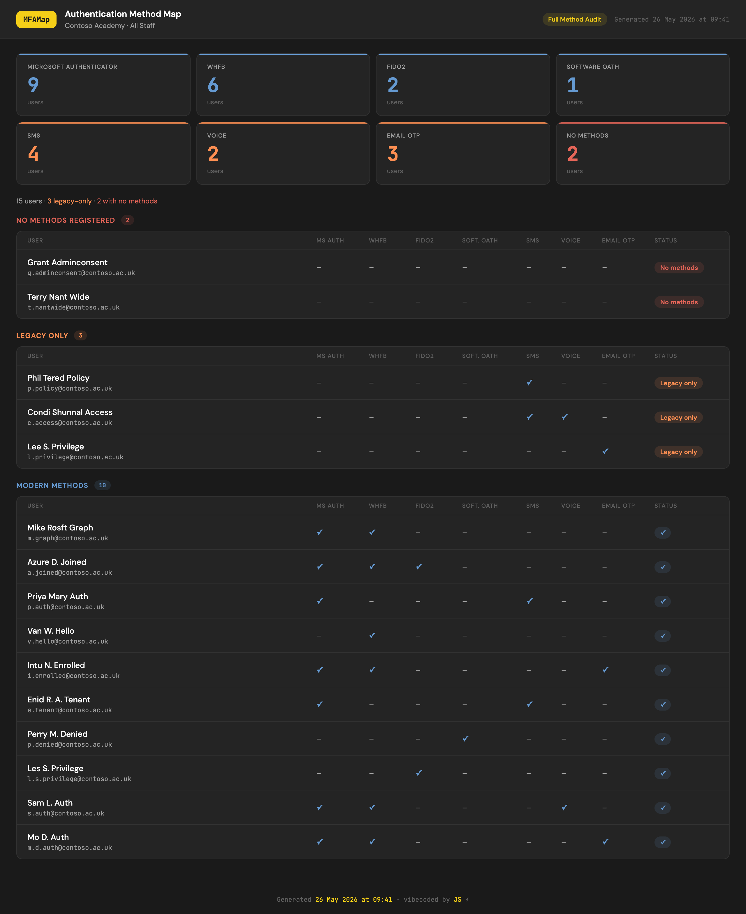

# ⚡ MFAMap

**Authentication method mapper for Microsoft Entra ID**

MFAMap generates a self-contained HTML dashboard showing authentication method registration across a target Entra group. Run the script, pick a mode, save the file. Open it in any browser, share it with anyone — no server, no login, no dependencies.



---

## ✨ Key features

- 🎛️ **Five tracking modes** — pick what to track at runtime
- 📊 **Delta reports** — run monthly and MFAMap auto-generates a comparison report showing who enrolled, who lapsed, and progress over time
- 💾 **Native save dialog** — file picker on Windows and macOS; falls back to auto-naming
- 📄 **PDF export** — Save as PDF button in every report; dark theme preserved in output
- 🏷️ **Branded reports** — `-Branded` flag produces a REDACTED branded version for client use
- 🧪 **Demo mode** — preview any report layout without connecting to Microsoft Graph
- 🔑 **No app registration** — authenticates via `Connect-MgGraph` with your existing admin account
- 🗂️ **Single output file** — fully self-contained HTML, shareable with no dependencies
- 🔍 **Risk filters** — Mode 5 includes SMS Only, Voice Only, and Legacy Only buttons that instantly show which users would be locked out if a legacy method were disabled
- 📥 **CSV export** — export any filtered view as a Name + UPN CSV, ready to paste into an Entra group import
- 🔌 **Auto-disconnect** — disconnects from Microsoft Graph automatically on completion

---

## 🎛️ Tracking modes

| Mode | Tracks | Used for |
|---|---|---|
| **1** | Microsoft Authenticator + Windows Hello for Business | Full enrolment tracking with partial enrolment detection |
| **2** | Windows Hello for Business only | WHfB rollout |
| **3** | Microsoft Authenticator only | Authenticator rollout |
| **4** | Passkey | FIDO2 keys or Authenticator device-bound passkeys |
| **5** | Full method audit | All seven authentication methods per user |

Modes 2–4 are binary — registered or not. Mode 1 adds a **Partially Enrolled** section for users who have one method but not both. Mode 5 groups users into Modern Methods, Legacy Only, and No Methods.

---

## ⚙️ Parameters

| Parameter | Required | Description |
|---|---|---|
| `-GroupId` | Yes (unless `-Demo`) | Object ID of the target Entra group |
| `-Mode` | No | Skip the mode prompt — pass `1` through `5` |
| `-OutputPath` | No | Override the output file path and skip the save dialog |
| `-Branded` | No | Produce a REDACTED branded report |
| `-Demo` | No | Run without a Graph connection using synthetic data |

---

## 📁 Recommended folder structure

Keep a folder per client or per group. MFAMap writes a JSON snapshot alongside each HTML report and automatically finds it the next time you run — no configuration needed. As long as you save consistently to the same folder, delta reports generate themselves.

```
Reports/
  Contoso/
    mfamap_AllStaff_Mode1_2026-05-01_0900.html
    mfamap_AllStaff_Mode1_2026-05-01_0900.json
    mfamap_AllStaff_Mode1_2026-06-01_0900.html       ← compared vs May automatically
    mfamap_AllStaff_Mode1_2026-06-01_0900.json
    mfamap_AllStaff_Mode1_2026-06-01_0900_delta.html ← progress since May
  FabrikamLtd/
    ...
```

---

## 🚀 Quick start

**1. Install the Microsoft Graph module** (one-time)

```powershell
Install-Module Microsoft.Graph -Scope CurrentUser -Force
```

**2. Get your group's Object ID**

In [entra.microsoft.com](https://entra.microsoft.com) → **Groups** → find your group → copy the **Object ID** from the Overview page.

**3. Run the script**

```powershell
# Interactive — choose mode at the prompt
.\MFAMap.ps1 -GroupId "your-group-object-id"

# Skip the mode prompt
.\MFAMap.ps1 -GroupId "your-group-object-id" -Mode 1

# REDACTED branded report
.\MFAMap.ps1 -GroupId "your-group-object-id" -Branded

# Preview without credentials
.\MFAMap.ps1 -Demo -Mode 1
.\MFAMap.ps1 -Demo -Mode 5 -Branded
```

**4. Open the report**

```
  Report saved to: .\mfamap_Staff_Mode1-Auth-WHfB_2026-06-01_0930.html
```

Double-click the file or open it in any browser.

---

## 📝 What counts as enrolled

### Mode 1 — Authenticator + WHfB

| Registered | Status |
|---|---|
| Both Authenticator and WHfB | ✅ Fully Enrolled |
| One method only | 🟡 Partially Enrolled |
| Neither | ❌ Not Registered |

> Software OATH / TOTP tokens count as Authenticator. Mode 3 shows a "TOTP only" badge to distinguish them.

### Modes 2, 3, 4

Binary — registered or not. Mode 3 shows a TOTP badge for software OATH tokens.

### Mode 5 — Full Method Audit

| Section | Criteria |
|---|---|
| **Modern Methods** | At least one of: Authenticator, WHfB, FIDO2, Software OATH |
| **Legacy Only** | Only SMS, Voice, and/or Email OTP |
| **No Methods** | Nothing registered |

The report includes a **Risk filters** strip with three buttons — **SMS Only**, **Voice Only**, and **Legacy Only** — that filter the table down to users in that exact situation. When a filter is active, **Copy UPNs** and **Download CSV** appear in the filter bar so you can export the list straight into an Entra group import.

---

## 🛡️ Permissions

MFAMap uses delegated permissions — it authenticates as you. No app registration required.

| Scope | Why |
|---|---|
| `Organization.Read.All` | Tenant display name |
| `Group.Read.All` | Group display name |
| `GroupMember.Read.All` | Group membership |
| `User.Read.All` | Resolve member display names and UPNs |
| `UserAuthenticationMethod.Read.All` | MFA registration status |

All read-only. MFAMap cannot make any changes.

---

## 📋 Requirements

- **PowerShell 7+** (recommended) or Windows PowerShell 5.1
- **Microsoft.Graph** PowerShell module
- At least **Authentication Administrator** or **Global Reader** role in the target tenant

---

## 🔒 Security

**No data leaves your machine.** The script queries Microsoft Graph directly and writes output locally. No telemetry, no logging endpoints.

**Google Fonts.** The HTML report loads fonts from `fonts.googleapis.com` at open time — no user data sent, just a font request. Falls back to system fonts in restricted environments.

**The output file contains real user data.** Names, email addresses, and MFA status. Treat it as internal data and share accordingly. The JSON snapshot files contain the same data.

---

## 📦 Dependencies

| Module | Used for |
|---|---|
| [Microsoft.Graph.Authentication](https://www.powershellgallery.com/packages/Microsoft.Graph.Authentication) | `Connect-MgGraph`, `Invoke-MgGraphRequest` |
| [Microsoft.Graph.Groups](https://www.powershellgallery.com/packages/Microsoft.Graph.Groups) | `Get-MgGroupMember` |

---

## 👏 Credits

vibecoded by JS ⚡
