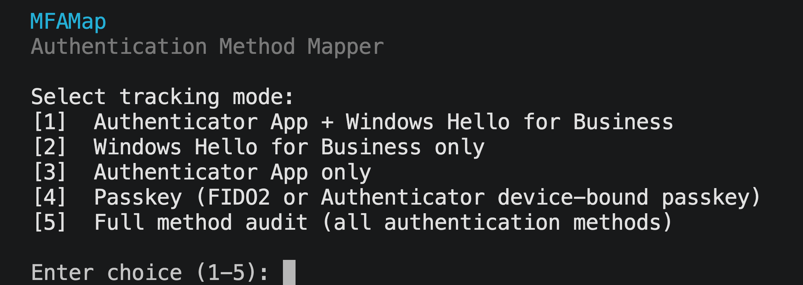

# ⚡ MFAMap

**Authentication method mapper for Microsoft Entra ID**

MFAMap generates a self-contained HTML dashboard showing authentication method registration across a target Entra group. Run the script, pick a tracking mode, save the file. Open it in any browser, share it with anyone — no server, no login, no dependencies.


---

## ✨ Key features

- 🎛️ **Five tracking modes** — pick what to track at runtime via an interactive menu
- 🗂️ **Single output file** — generates one self-contained HTML file with no dependencies
- 💾 **Native save dialog** — file save dialog appears automatically on Windows and macOS; falls back to auto-naming if unavailable
- 📄 **PDF export** — every report includes a Save as PDF button; dark theme is preserved exactly as-is in the output
- 🏷️ **Branded reports** — `-Branded` flag produces a fully branded version of the report for client-facing use
- 🧪 **Demo mode** — `-Demo` runs without connecting to Microsoft Graph, using synthetic data to preview any mode or layout
- 🔑 **Uses your existing credentials** — authenticates via `Connect-MgGraph` with your own admin account; no app registration required
- 🏢 **Tenant and group name in the report** — header shows exactly which tenant and group you ran against
- 🎨 **Semantic data colours** — registered, partial, and not-registered states use consistent colours throughout
- 📁 **Auto-named output** — HTML file is named with the group name, mode, and timestamp automatically
- 🎯 **Group-scoped** — targets a specific Entra group, not your entire tenant
- 🚨 **Not Registered first** — users with nothing registered are surfaced at the top
- 🔍 **Method filtering** — Mode 5 stat cards act as filters; click any method to isolate users who have it registered
- 📤 **Fully portable** — the output HTML file can be opened, shared, or emailed with no auth required
- 🔄 **Re-run to refresh** — run the script again to regenerate with fresh data
- 🔌 **Auto-disconnect** — the script disconnects from Microsoft Graph automatically on completion

---

## 🎛️ Tracking modes

When you run the script you're prompted to choose what to track:



| Mode | Tracks | Used for |
|---|---|---|
| **1** | Microsoft Authenticator + Windows Hello for Business | Full enrolment tracking with partial enrolment detection |
| **2** | Windows Hello for Business only | Tracking WHfB rollout independently |
| **3** | Microsoft Authenticator only | Tracking Authenticator rollout independently |
| **4** | Passkey | Tracking passkey adoption (FIDO2 keys or Authenticator device-bound passkeys) |
| **5** | Full method audit | Complete view of all authentication methods across the group |

Modes 2, 3, and 4 are binary — registered or not. Mode 1 includes a **Partially Enrolled** section for users who have one method but not both. Mode 5 shows all seven methods per user and groups them into Modern Methods, Legacy Only, and No Methods.

---

## 🔧 How it works

```
.\MFAMap.ps1 -GroupId "your-group-id"
        ↓
Choose tracking mode (1-5)
        ↓
Connect-MgGraph  (sign in with your admin account each run)
        ↓
Invoke-MgGraphRequest — direct Graph API calls
/organization                                              (tenant display name)
/groups/{id}                                               (group display name)
/groups/{id}/members                                       (group membership)
/users/{id}                                                (user display name + UPN)
/users/{id}/authentication/microsoftAuthenticatorMethods   (modes 1, 3, 4, 5)
/users/{id}/authentication/softwareOathMethods             (modes 1, 3, 5 — fallback / TOTP)
/users/{id}/authentication/windowsHelloForBusinessMethods  (modes 1, 2, 5)
/users/{id}/authentication/fido2Methods                    (modes 4, 5)
/users/{id}/authentication/phoneMethods                    (mode 5 — SMS and voice)
/users/{id}/authentication/emailMethods                    (mode 5 — email OTP)
        ↓
Native save dialog (Windows / macOS) or auto-named file
        ↓
Self-contained HTML file written to disk
mfamap_GroupName_Mode1-Auth-WHfB_2026-04-23_0941.html
        ↓
Open in any browser — no auth, no server, no dependencies
```

---

## 🛡️ Permissions

MFAMap uses `Connect-MgGraph` with delegated permissions — it authenticates as you, using your existing admin account. No app registration is required.

The script requests five Graph scopes at sign-in:

| Scope | Why it's needed |
|---|---|
| `Organization.Read.All` | Read the tenant display name |
| `Group.Read.All` | Read the group display name |
| `GroupMember.Read.All` | Read the membership of the target group |
| `User.Read.All` | Resolve member IDs to display names and UPNs |
| `UserAuthenticationMethod.Read.All` | Read MFA registration details for each user |

All are read-only. The script cannot make any changes to users, groups, or authentication methods.

---

## 📋 Requirements

- **PowerShell 7+** (recommended) or Windows PowerShell 5.1
- **Microsoft.Graph** PowerShell module — see Quick Start below
- An account with at least **Authentication Administrator** or **Global Reader** role in the target tenant

---

## 🚀 Quick start

**1. Install the Microsoft Graph module** (one-time)

```powershell
Install-Module Microsoft.Graph -Scope CurrentUser -Force
```

**2. Get your group's Object ID**

In [entra.microsoft.com](https://entra.microsoft.com) → **Groups** → find your group → copy the **Object ID** from the Overview page.

**3. Run the script**

```powershell
.\MFAMap.ps1 -GroupId "your-group-object-id"
```

When prompted, pick a tracking mode (1-5). Sign in with your Microsoft admin account when prompted. A save dialog will appear — choose where to save the report, or cancel to use the auto-named file in the current directory.

**4. Open the report**

The script prints the exact filename on completion:

```
  Report saved to: .\mfamap_Staff_Mode1-Auth-WHfB_2026-06-01_0930.html
```

Double-click the file or open it in any browser.

---

## ⚙️ Parameters

| Parameter | Required | Default | Description |
|---|---|---|---|
| `-GroupId` | Required unless using `-Demo` | — | Object ID of the target Entra group |
| `-OutputPath` | No | Auto-generated | Override the output file path and skip the save dialog |
| `-Mode` | No | Interactive prompt | Skip the mode prompt — pass `1` through `5` |
| `-Branded` | No | Off | Produce a REDACTED branded report |
| `-Demo` | No | Off | Run without a Graph connection using synthetic data |

**Examples:**

```powershell
# Basic — save dialog appears with auto-suggested filename
.\MFAMap.ps1 -GroupId "11223344-5566-7788-99aa-bbccddeeff00"

# Custom output path (skips dialog)
.\MFAMap.ps1 -GroupId "11223344-5566-7788-99aa-bbccddeeff00" -OutputPath "C:\Reports\mfa-report.html"

# Skip the mode prompt
.\MFAMap.ps1 -GroupId "11223344-5566-7788-99aa-bbccddeeff00" -Mode 3

# REDACTED branded report
.\MFAMap.ps1 -GroupId "11223344-5566-7788-99aa-bbccddeeff00" -Branded

# Demo — preview any mode without credentials
.\MFAMap.ps1 -Demo -Mode 1
.\MFAMap.ps1 -Demo -Mode 5 -Branded
```

---

## 📝 What counts as enrolled per mode

### Mode 1 — Authenticator + WHfB

| Method registered | Counted as |
|---|---|
| Microsoft Authenticator app | ✅ Authenticator |
| Software OATH / TOTP token | ✅ Authenticator (TOTP only badge) |
| Windows Hello for Business | ✅ Windows Hello |
| One method only | 🟡 Partially Enrolled |
| Neither | ❌ Not Registered |

A user is **Fully Enrolled** only when both Authenticator (or TOTP) and WHfB are registered.

### Mode 2 — Windows Hello for Business only

| Method registered | Counted as |
|---|---|
| Windows Hello for Business | ✅ Registered |
| Anything else only | ❌ Not Registered |

### Mode 3 — Authenticator only

| Method registered | Counted as |
|---|---|
| Microsoft Authenticator app | ✅ Registered |
| Software OATH / TOTP token | ✅ Registered (TOTP only badge shown) |
| Anything else only | ❌ Not Registered |

### Mode 4 — Passkey

| Method registered | Counted as |
|---|---|
| FIDO2 security key | ✅ Registered |
| Microsoft Authenticator device-bound passkey | ✅ Registered |
| Anything else only | ❌ Not Registered |

### Mode 5 — Full Method Audit

All seven authentication methods are checked per user. Users are grouped into:

| Section | Criteria |
|---|---|
| **No Methods** | No registered authentication methods at all |
| **Legacy Only** | Only SMS, Voice, and/or Email OTP — no modern methods |
| **Modern Methods** | At least one of: Authenticator, WHfB, FIDO2, Software OATH |

The method count banner at the top shows how many users have each method. Clicking a method card filters the table to show only users with that method registered.

---

## 🔒 Security

**No data leaves your machine.** The script queries Microsoft Graph directly from your PowerShell session and writes output to a local HTML file. No telemetry, no logging endpoints.

**Note on Google Fonts.** The generated HTML report loads fonts from `fonts.googleapis.com` at open time. No user data is sent — it's a standard font request — but it does mean the report makes a request to Google's CDN when opened in a browser. If you're in a restricted or air-gapped environment the fonts will silently fall back to system fonts.

**Delegated permissions only.** The script authenticates as you — it can only see what your account can see. No application permissions, no background processes, no scheduled jobs.

**The output file contains no credentials.** The generated HTML is static — it contains only the data retrieved at generation time. No tokens, secrets, or connection strings.

**Treat the output file as internal data.** It contains names, email addresses, and MFA status of your users. Share it only with people who should have that information.

**Note on the consent prompt.** MFAMap uses `Connect-MgGraph` which routes through the shared Microsoft Graph Command Line Tools app registration. The consent screen may show a large list of permissions — these reflect the full history of that shared app in your tenant, not what MFAMap specifically requests. Only the five scopes listed above are requested at runtime.

**Automatic disconnect.** MFAMap calls `Disconnect-MgGraph` automatically at the end of each run and confirms the session was cleared. No manual cleanup required.

---

## 🔄 Refreshing during a session

Re-run the script to generate a fresh report. Each run produces a new timestamped file so previous snapshots are preserved. The script connects and disconnects fresh on every run.

You can switch modes between runs — just choose a different number when prompted.

---

## 📦 Dependencies

| Module | Used for |
|---|---|
| [Microsoft.Graph.Authentication](https://www.powershellgallery.com/packages/Microsoft.Graph.Authentication) | `Connect-MgGraph`, `Invoke-MgGraphRequest` |
| [Microsoft.Graph.Groups](https://www.powershellgallery.com/packages/Microsoft.Graph.Groups) | `Get-MgGroupMember` |

All other Graph calls use `Invoke-MgGraphRequest` directly to avoid module version conflicts.

---

## 👏 Credits

vibecoded by JS ⚡
